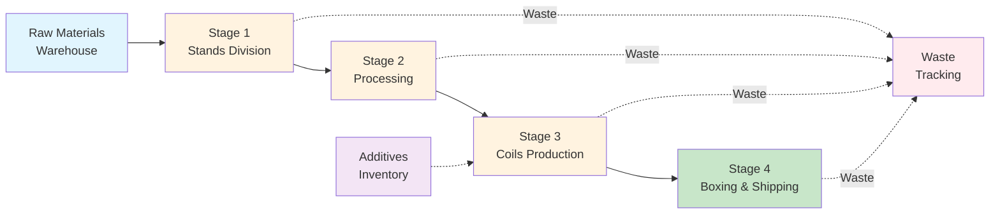
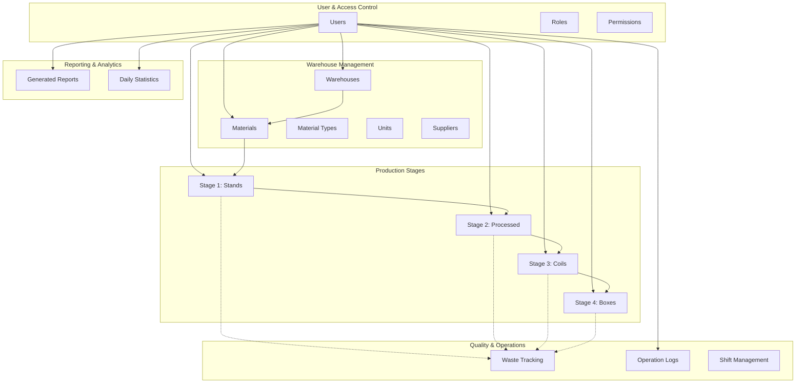

# Iron Factory Database Schema - Mermaid ER Diagram

## Full Database Schema

```mermaid
erDiagram
    %% ========================================
    %% User Management & Access Control
    %% ========================================
    
    users ||--o{ roles : "has role"
    users ||--o{ permissions : "created by"
    users ||--o{ user_permissions : "has custom permissions"
    users ||--o{ shift_assignments : "assigned to"
    users ||--o{ shift_handovers : "from/to"
    
    roles ||--o{ users : "assigned to"
    roles ||--o{ role_permissions : "has"
    roles ||--o{ roles : "created by"
    
    permissions ||--o{ role_permissions : "assigned to roles"
    permissions ||--o{ permissions : "created by"
    
    role_permissions }o--|| roles : "belongs to"
    role_permissions }o--|| permissions : "grants"
    
    user_permissions }o--|| users : "belongs to"
    
    %% ========================================
    %% Warehouse & Inventory Management
    %% ========================================
    
    warehouses ||--o{ materials : "stores"
    warehouses ||--o{ warehouse_transactions : "has transactions"
    warehouses ||--o{ warehouse_transactions : "from warehouse"
    warehouses ||--o{ warehouse_transactions : "to warehouse"
    
    material_types ||--o{ materials : "categorizes"
    units ||--o{ materials : "measures"
    units ||--o{ warehouse_transactions : "transaction unit"
    
    materials ||--o{ stage1_stands : "used in"
    materials ||--o{ delivery_notes : "delivered"
    materials ||--o{ material_details : "has details"
    materials ||--o{ warehouse_transactions : "tracked in"
    
    suppliers ||--o{ materials : "supplies"
    suppliers ||--o{ purchase_invoices : "invoices"
    suppliers ||--o{ additives_inventory : "supplies additives"
    
    purchase_invoices ||--o{ materials : "contains"
    
    %% ========================================
    %% Production Flow (4 Stages)
    %% ========================================
    
    materials ||--o{ stage1_stands : "raw material"
    stage1_stands ||--o{ stage2_processed : "processed from"
    stage2_processed ||--o{ stage3_coils : "coils from"
    stage3_coils ||--o{ box_coils : "packed in"
    stage4_boxes ||--o{ box_coils : "contains"
    
    additives_inventory ||--o{ stage3_coils : "dye additive"
    additives_inventory ||--o{ stage3_coils : "plastic additive"
    
    %% ========================================
    %% Waste & Quality Management
    %% ========================================
    
    waste_limits ||--o{ waste_tracking : "defines limits"
    users ||--o{ waste_tracking : "reports/approves"
    
    %% ========================================
    %% Operations & Reporting
    %% ========================================
    
    users ||--o{ operation_logs : "performs actions"
    users ||--o{ generated_reports : "generates"
    users ||--o{ daily_statistics : "calculates"
    
    %% ========================================
    %% System Configuration
    %% ========================================
    
    users ||--o{ system_formulas : "configures"
    users ||--o{ system_settings : "manages"
    
    %% ========================================
    %% Table Definitions
    %% ========================================
    
    users {
        int id PK
        varchar name
        varchar email UK
        varchar password
        int role_id FK
        varchar role
        varchar shift
        boolean is_active
        datetime email_verified_at
        varchar remember_token
        datetime created_at
        datetime updated_at
    }
    
    roles {
        int id PK
        varchar role_name UK
        varchar role_name_en UK
        varchar role_code UK
        text description
        int level
        boolean is_system
        boolean is_active
        int created_by FK
        datetime created_at
        datetime updated_at
    }
    
    permissions {
        int id PK
        varchar permission_name UK
        varchar permission_name_en UK
        varchar permission_code UK
        varchar module
        text description
        boolean is_system
        boolean is_active
        int created_by FK
        datetime created_at
        datetime updated_at
    }
    
    role_permissions {
        int id PK
        int role_id FK
        int permission_id FK
        boolean can_create
        boolean can_read
        boolean can_update
        boolean can_delete
        boolean can_approve
        boolean can_export
        int created_by FK
        datetime created_at
        datetime updated_at
    }
    
    user_permissions {
        int id PK
        int user_id FK
        varchar permission_name
        boolean can_create
        boolean can_read
        boolean can_update
        boolean can_delete
        datetime created_at
        datetime updated_at
    }
    
    warehouses {
        int id PK
        varchar warehouse_code UK
        varchar warehouse_name
        varchar warehouse_type
        varchar location
        text description
        decimal capacity
        varchar capacity_unit
        varchar manager_name
        varchar contact_number
        boolean is_active
        int created_by FK
        datetime created_at
        datetime updated_at
    }
    
    material_types {
        int id PK
        varchar type_code UK
        varchar type_name
        varchar category
        text description
        text specifications
        varchar default_unit
        decimal standard_cost
        varchar storage_conditions
        int shelf_life_days
        boolean is_active
        int created_by FK
        datetime created_at
        datetime updated_at
    }
    
    units {
        int id PK
        varchar unit_code UK
        varchar unit_name
        varchar unit_name_en
        varchar unit_symbol
        varchar unit_type
        decimal conversion_factor
        varchar base_unit
        text description
        boolean is_active
        int created_by FK
        datetime created_at
        datetime updated_at
    }
    
    materials {
        int id PK
        int warehouse_id FK
        int material_type_id FK
        varchar barcode UK
        varchar batch_number
        varchar material_type
        decimal original_weight
        decimal remaining_weight
        varchar unit
        int unit_id FK
        int supplier_id FK
        varchar delivery_note_number
        date manufacture_date
        date expiry_date
        varchar shelf_location
        int purchase_invoice_id FK
        varchar status
        text notes
        int created_by FK
        datetime created_at
        datetime updated_at
    }
    
    material_details {
        int id PK
        int material_id FK
        varchar detail_key
        text detail_value
        varchar data_type
        boolean is_visible
        int display_order
        int created_by FK
        datetime created_at
        datetime updated_at
    }
    
    suppliers {
        int id PK
        varchar name
        varchar contact_person
        varchar phone
        varchar email
        text address
        boolean is_active
        int created_by FK
        datetime created_at
        datetime updated_at
    }
    
    purchase_invoices {
        int id PK
        varchar invoice_number UK
        int supplier_id FK
        decimal total_amount
        varchar currency
        date invoice_date
        date due_date
        varchar status
        int created_by FK
        datetime created_at
        datetime updated_at
    }
    
    delivery_notes {
        int id PK
        varchar note_number UK
        int material_id FK
        decimal delivered_weight
        date delivery_date
        varchar driver_name
        varchar vehicle_number
        int received_by FK
        datetime created_at
        datetime updated_at
    }
    
    warehouse_transactions {
        int id PK
        varchar transaction_number UK
        int warehouse_id FK
        int material_id FK
        varchar transaction_type
        decimal quantity
        int unit_id FK
        int from_warehouse_id FK
        int to_warehouse_id FK
        varchar reference_number
        text notes
        int created_by FK
        int approved_by FK
        datetime approved_at
        datetime created_at
        datetime updated_at
    }
    
    stage1_stands {
        int id PK
        varchar barcode UK
        varchar parent_barcode
        int material_id FK
        varchar stand_number
        varchar wire_size
        decimal weight
        decimal waste
        decimal remaining_weight
        varchar status
        int created_by FK
        datetime completed_at
        datetime created_at
        datetime updated_at
    }
    
    stage2_processed {
        int id PK
        varchar barcode UK
        varchar parent_barcode
        int stage1_id FK
        text process_details
        decimal input_weight
        decimal output_weight
        decimal waste
        decimal remaining_weight
        varchar status
        int created_by FK
        datetime completed_at
        datetime created_at
        datetime updated_at
    }
    
    additives_inventory {
        int id PK
        varchar type
        varchar name
        varchar color
        decimal quantity
        varchar unit
        decimal cost_per_unit
        int supplier_id FK
        date expiry_date
        boolean is_active
        int created_by FK
        datetime created_at
        datetime updated_at
    }
    
    stage3_coils {
        int id PK
        varchar barcode UK
        varchar parent_barcode
        int stage2_id FK
        varchar coil_number
        varchar wire_size
        decimal base_weight
        decimal dye_weight
        decimal plastic_weight
        decimal total_weight
        varchar color
        decimal waste
        int dye_additive_id FK
        int plastic_additive_id FK
        varchar status
        int created_by FK
        datetime completed_at
        datetime created_at
        datetime updated_at
    }
    
    stage4_boxes {
        int id PK
        varchar barcode UK
        varchar packaging_type
        int coils_count
        decimal total_weight
        decimal waste
        varchar status
        text customer_info
        text shipping_address
        varchar tracking_number
        int created_by FK
        datetime packed_at
        datetime shipped_at
        datetime created_at
        datetime updated_at
    }
    
    box_coils {
        int id PK
        int box_id FK
        int coil_id FK
        datetime added_at
    }
    
    shift_assignments {
        int id PK
        int user_id FK
        int stage_number
        date shift_date
        time start_time
        time end_time
        varchar status
        datetime created_at
        datetime updated_at
    }
    
    shift_handovers {
        int id PK
        int from_user_id FK
        int to_user_id FK
        int stage_number
        text handover_items
        text notes
        datetime handover_time
        boolean supervisor_approved
        int approved_by FK
        datetime created_at
        datetime updated_at
    }
    
    waste_limits {
        int id PK
        int stage_number UK
        varchar stage_name
        decimal max_waste_percentage
        decimal warning_percentage
        boolean alert_supervisors
        boolean stop_production
        int created_by FK
        int updated_by FK
        datetime created_at
        datetime updated_at
    }
    
    waste_tracking {
        int id PK
        int stage_number
        varchar item_barcode
        decimal waste_amount
        decimal waste_percentage
        text waste_reason
        int reported_by FK
        boolean supervisor_approved
        int approved_by FK
        datetime approved_at
        datetime created_at
        datetime updated_at
    }
    
    operation_logs {
        int id PK
        int user_id FK
        varchar action
        varchar table_name
        int record_id
        text old_values
        text new_values
        varchar ip_address
        text user_agent
        datetime created_at
    }
    
    generated_reports {
        int id PK
        varchar report_type
        varchar report_title
        date date_from
        date date_to
        text parameters
        varchar file_path
        int file_size
        int generated_by FK
        datetime generated_at
    }
    
    daily_statistics {
        int id PK
        date statistics_date UK
        decimal total_materials_received
        int total_stands_created
        int total_coils_produced
        int total_boxes_packed
        decimal total_waste_amount
        decimal waste_percentage
        int active_workers
        int created_by FK
        datetime calculated_at
    }
    
    system_formulas {
        int id PK
        varchar formula_name UK
        int stage_number
        text formula_expression
        text variables
        text default_values
        text description
        boolean is_active
        int created_by FK
        datetime created_at
        datetime updated_at
    }
    
    system_settings {
        int id PK
        varchar setting_key UK
        text setting_value
        varchar setting_type
        varchar category
        text description
        boolean is_public
        int updated_by FK
        datetime created_at
        datetime updated_at
    }
```

## Simplified Production Flow Diagram

## Module Relationships Diagram

## Database Statistics

- **Total Tables**: 33 tables
- **Core Modules**:
  - User Management: 5 tables
  - Warehouse Management: 9 tables
  - Production Stages: 7 tables
  - Quality Management: 2 tables
  - Reporting: 3 tables
  - System Configuration: 2 tables
  - Laravel System: 5 tables

## Key Relationships

### Production Flow
1. **Materials** → **Stage1 (Stands)** → **Stage2 (Processed)** → **Stage3 (Coils)** → **Stage4 (Boxes)**
2. Each stage tracks barcode lineage (parent_barcode)
3. Waste is tracked at every stage

### Access Control
- **Users** have **Roles**
- **Roles** have **Permissions** (via role_permissions)
- Users can have custom **User Permissions** override

### Inventory Tracking
- **Warehouses** store **Materials**
- **Materials** have **Material Types** and **Units**
- **Suppliers** provide materials via **Purchase Invoices**
- **Warehouse Transactions** track all movements

### Quality Management
- **Waste Limits** define acceptable waste per stage
- **Waste Tracking** records actual waste with approval workflow
- **Operation Logs** audit all system actions

## Barcode System

| Stage | Barcode Format | Example |
|-------|---------------|---------|
| Warehouse | WH-XXX-2025 | WH-001-2025 |
| Stage 1 | ST1-XXX-2025 | ST1-042-2025 |
| Stage 2 | ST2-XXX-2025 | ST2-156-2025 |
| Stage 3 | CO3-XXX-2025 | CO3-289-2025 |
| Stage 4 | BOX4-XXX-2025 | BOX4-073-2025 |

---

**Generated**: November 13, 2025  
**Database**: iron_factory  
**Version**: 1.0.0
