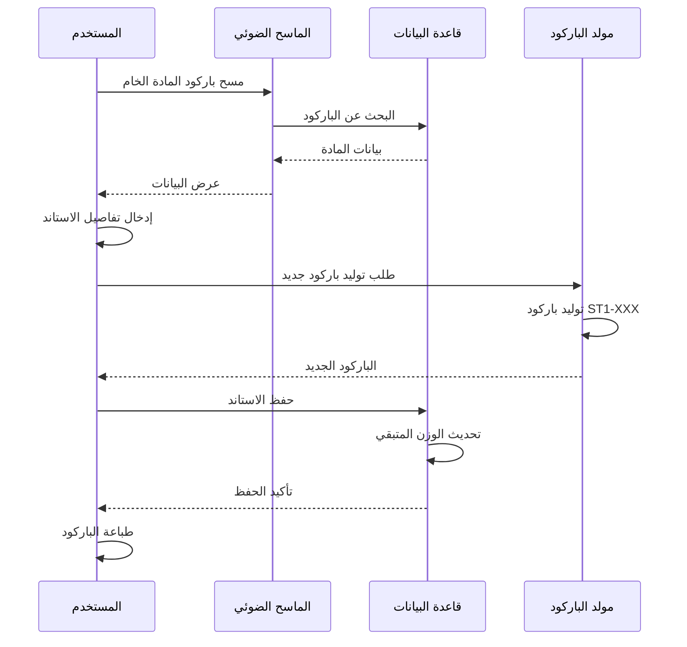
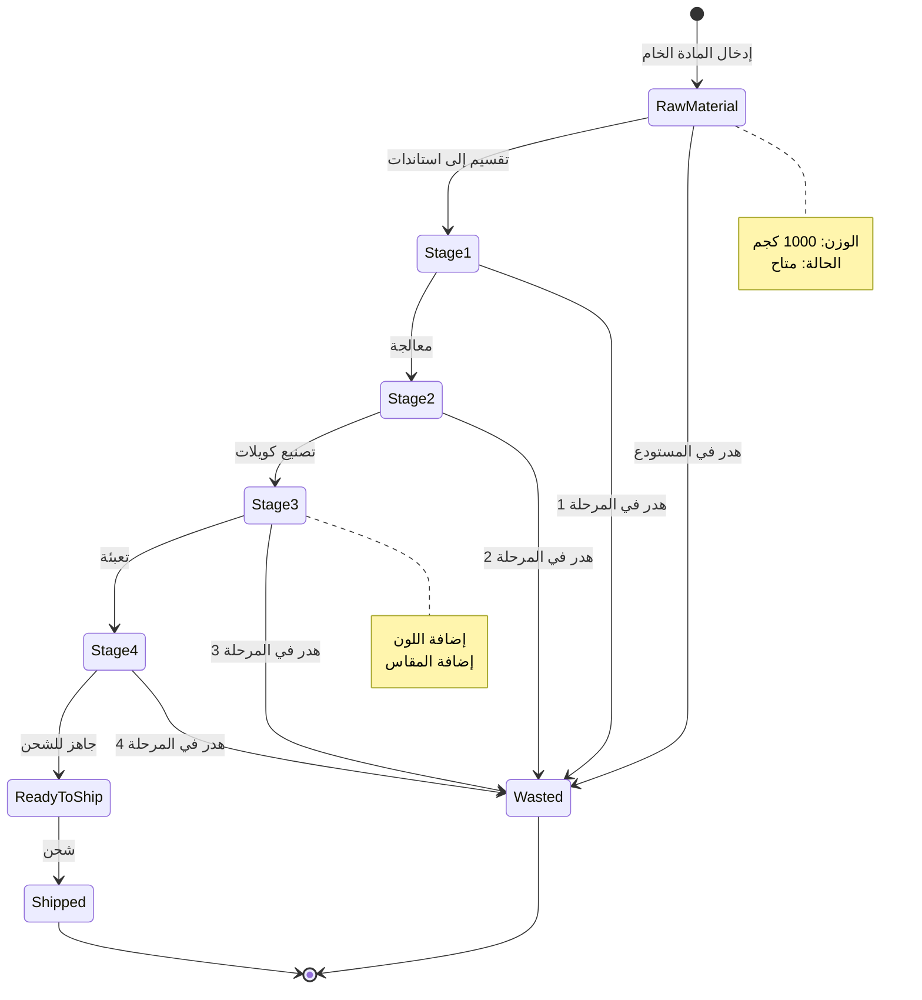
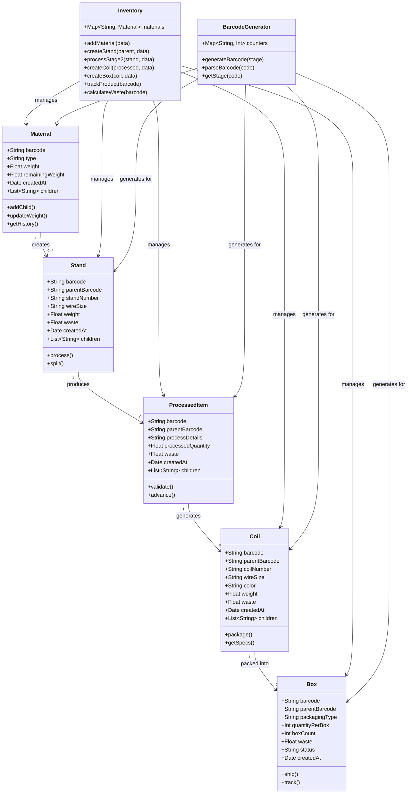
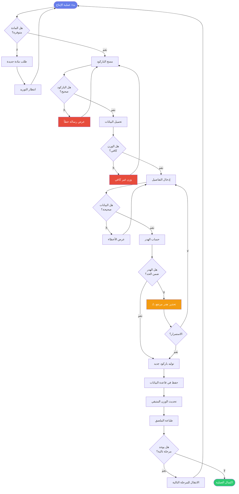
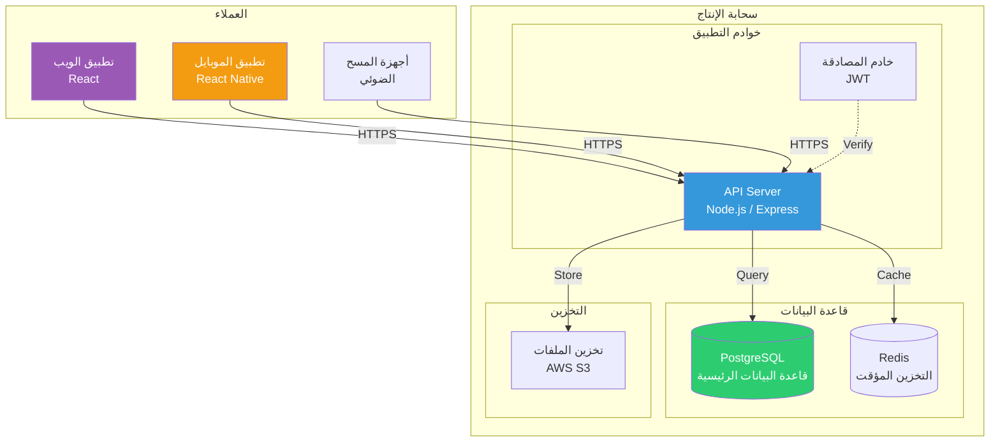
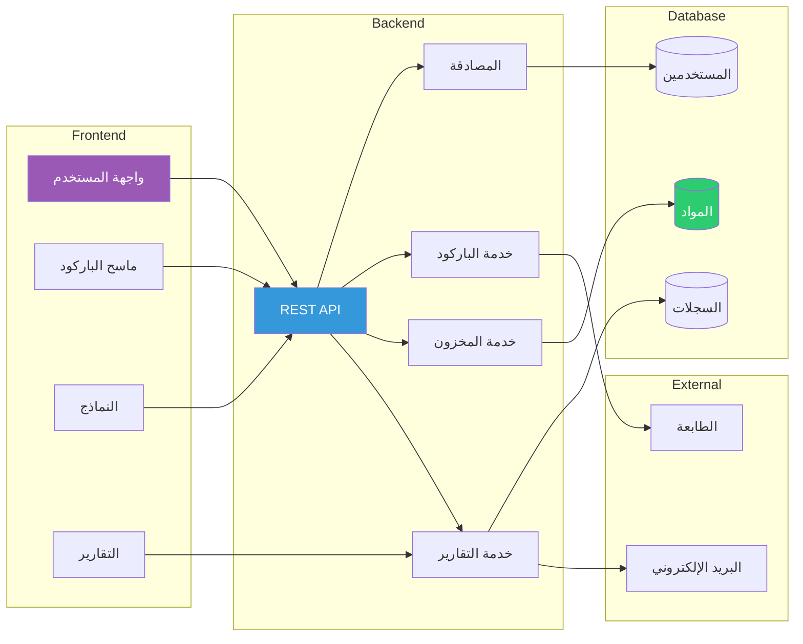
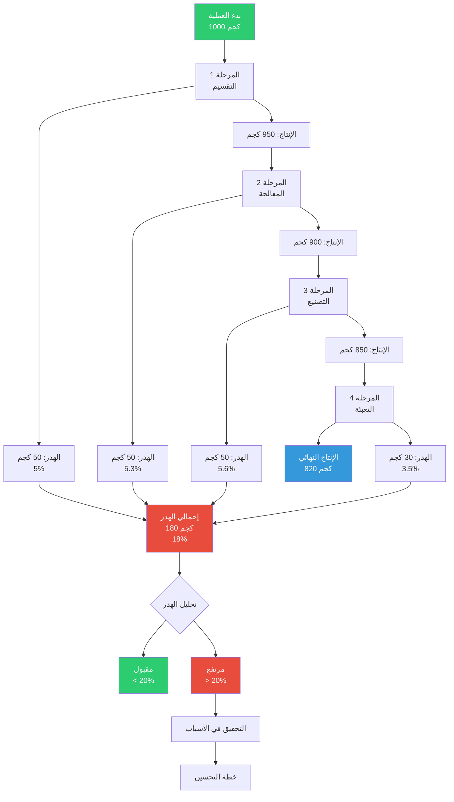
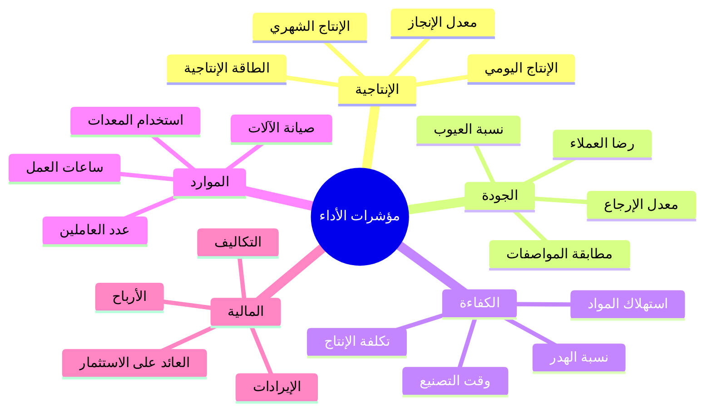

# 📊 مخططات Mermaid إضافية للمشروع

## 1. مخطط تسلسل العمليات (Sequence Diagram)



---

## 2. مخطط حالات المنتج (State Diagram)



---

## 3. مخطط الفئات (Class Diagram)



---

## 4. مخطط تدفق اتخاذ القرار



---

## 5. مخطط التوزيع (Deployment Diagram)



---

## 6. مخطط الأنشطة اليومية

```mermaid
gantt
    title جدول الإنتاج اليومي
    dateFormat HH:mm
    axisFormat %H:%M
    
    section المستودع
    استلام المواد           :done, 08:00, 1h
    فحص الجودة             :done, 09:00, 30m
    إدخال البيانات          :done, 09:30, 30m
    
    section المرحلة 1
    تقسيم المواد            :active, 10:00, 2h
    توليد الباركود          :active, 11:00, 1h
    
    section المرحلة 2
    المعالجة الأولية        :12:00, 2h
    الفحص                  :14:00, 30m
    
    section المرحلة 3
    التصنيع                :14:30, 3h
    مراقبة الجودة          :17:00, 1h
    
    section المرحلة 4
    التعبئة                :crit, 18:00, 2h
    الشحن                  :crit, 20:00, 1h
```



---

## 7. مخطط العلاقات والاعتماديات



---

## 8. مخطط الأدوار والصلاحيات

```mermaid
graph TD
    System[نظام الإنتاج] --> Admin[مدير النظام]
    System --> Manager[مدير الإنتاج]
    System --> Supervisor[مشرف]
    System --> Worker[عامل]
    System --> Viewer[مراقب]
    
    Admin --> AdminPerms[صلاحيات المدير]
    Manager --> ManagerPerms[صلاحيات المدير]
    Supervisor --> SupervisorPerms[صلاحيات المشرف]
    Worker --> WorkerPerms[صلاحيات العامل]
    Viewer --> ViewerPerms[صلاحيات المراقب]
    
    AdminPerms --> P1[إدارة المستخدمين]
    AdminPerms --> P2[تعديل الإعدادات]
    AdminPerms --> P3[حذف البيانات]
    AdminPerms --> P4[عرض جميع التقارير]
    
    ManagerPerms --> P5[الموافقة على العمليات]
    ManagerPerms --> P6[تعديل البيانات]
    ManagerPerms --> P7[عرض التقارير]
    ManagerPerms --> P8[إدارة المخزون]
    
    SupervisorPerms --> P9[مراقبة الإنتاج]
    SupervisorPerms --> P10[تعديل بيانات المرحلة]
    SupervisorPerms --> P11[عرض التقارير الأساسية]
    
    WorkerPerms --> P12[مسح الباركود]
    WorkerPerms --> P13[إدخال البيانات]
    WorkerPerms --> P14[عرض المهام]
    
    ViewerPerms --> P15[عرض البيانات فقط]
    ViewerPerms --> P16[عرض التقارير]
    
    style Admin fill:#e74c3c,color:#fff
    style Manager fill:#f39c12,color:#fff
    style Supervisor fill:#3498db,color:#fff
    style Worker fill:#2ecc71,color:#fff
    style Viewer fill:#95a5a6,color:#fff
```



---

## 9. مخطط تدفق الهدر والخسائر



---

## 10. مخطط الأداء والمقاييس (Metrics)



---

## كيفية استخدام هذه المخططات

1. **في التوثيق**: انسخ الكود والصقه في ملفات Markdown
2. **في GitHub**: سيتم عرضها تلقائياً
3. **في المواقع**: استخدم مكتبة Mermaid.js
4. **في التطبيقات**: دمج مع أدوات مثل Draw.io أو PlantUML

### مثال HTML:
```html
<!DOCTYPE html>
<html>
<head>
    <script src="https://cdn.jsdelivr.net/npm/mermaid/dist/mermaid.min.js"></script>
    <script>mermaid.initialize({startOnLoad:true});</script>
</head>
<body>
    <div class="mermaid">
        graph TD
            A[Start] --> B[Process]
            B --> C[End]
    </div>
</body>
</html>
```
