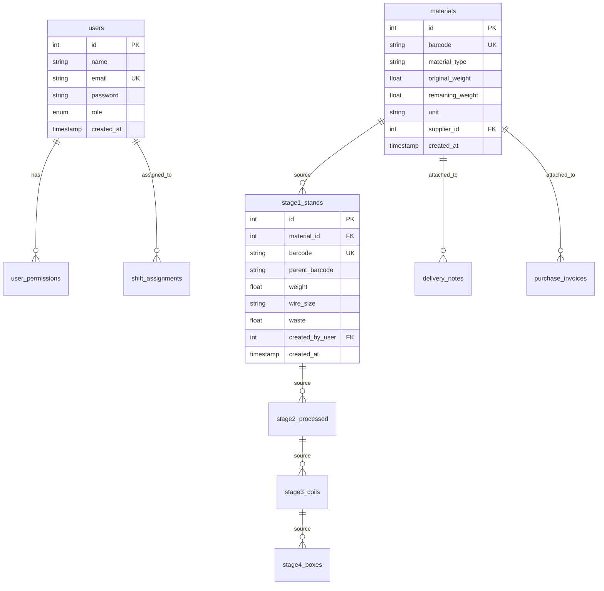

# 🏭 تحليل مشروع مصنع الحديد وتصميم قاعدة البيانات

## 📋 نظرة عامة عن المشروع

هذا المشروع عبارة عن نظام إدارة الإنتاج الشامل لمصنع الحديد، يهدف لتتبع المواد الخام من دخولها المستودع حتى تصبح منتجاً نهائياً جاهزاً للشحن عبر 4 مراحل إنتاجية أساسية مع نظام باركود متسلسل.

---

## 🎯 المراحل الإنتاجية الأربع

### 1️⃣ المرحلة الأولى: المستودع (Warehouse)
- **الغرض**: استقبال وتخزين المواد الخام
- **المدخلات**: مواد خام (سلك، معادن، إلخ)
- **المخرجات**: مواد مجهزة للتقسيم
- **الباركود**: `WH-XXX-2025`

### 2️⃣ المرحلة الثانية: التقسيم والاستاندات (Stage 1)
- **الغرض**: تقسيم المواد الخام إلى استاندات حسب المواصفات
- **المدخلات**: مواد من المستودع
- **المخرجات**: استاندات بأوزان ومقاسات محددة
- **الباركود**: `ST1-XXX-2025`

### 3️⃣ المرحلة الثالثة: المعالجة (Stage 2)
- **الغرض**: معالجة الاستاندات لتجهيزها للتصنيع
- **المدخلات**: استاندات من المرحلة الأولى
- **المخرجات**: مواد معالجة جاهزة لصنع الكويلات
- **الباركود**: `ST2-XXX-2025`

### 4️⃣ المرحلة الرابعة: تصنيع الكويلات (Stage 3)
- **الغرض**: تصنيع الكويلات مع إضافة الصبغة والبلاستيك
- **المدخلات**: مواد معالجة + صبغة + بلاستيك
- **المخرجات**: كويلات ملونة حسب المطلوب
- **الباركود**: `CO3-XXX-2025`

### 5️⃣ المرحلة الخامسة: التعبئة والتغليف (Stage 4)
- **الغرض**: تعبئة الكويلات في كراتين للشحن
- **المدخلات**: كويلات جاهزة
- **المخرجات**: كراتين معبأة جاهزة للشحن
- **الباركود**: `BOX4-XXX-2025`

---

## 💬 إجابة أسئلة العميل

### 1️⃣ السؤال الأول: نقطة الاستاندات في المرحلة الأولى
**السؤال**: *نقطة الاستاندات في المرحلة الأولى هل تكون مدخلة مسبقا في النظام ويتم اختيارها وإدخال وزنها؟ وما هو الاستاند بالضبط؟*

**الإجابة**:
- **الاستاند**: هو وحدة تقسيم للمادة الخام حسب المواصفات المطلوبة (الوزن والمقاس)
- **طريقة العمل**:
  - الاستاندات **ليست مدخلة مسبقاً** بل يتم إنشاؤها ديناميكياً
  - عند وصول مادة خام للمستودع (مثل 1000 كجم سلك)
  - العامل يقسمها حسب الحاجة: استاند 100 كجم مقاس 2.5مم، استاند 150 كجم مقاس 3.0مم
  - النظام يولد باركود فريد لكل استاند ويربطه بالمادة الأم
- **في النظام**: جدول `standards_config` للمواصفات المسموحة + جدول `stage1_stands` للاستاندات المنشأة

### 2️⃣ السؤال الثاني: إدارة الهدر
**السؤال**: *في الهدر مثلاً إذ كان هناك هدر والموظف المسؤول من المرحلة لم يدخل هدر طريقة حلها إداريا كيف هل عن طريق التتبع؟*

**الإجابة**:
- **آلية التتبع**:
  - حساب الهدر تلقائياً بمقارنة الوزن المدخل مع الوزن المخرج
  - تسجيل تلقائي للفروق في جدول `waste_tracking`
  - تقارير يومية للهدر غير المُبرر
- **الحلول الإدارية المقترحة**:
  - **تنبيهات تلقائية** عند تجاوز نسبة هدر محددة (مثال: 3%)
  - **إجبار إدخال سبب الهدر** قبل إنهاء المرحلة
  - **تقارير إدارية** يومية تظهر الهدر غير المُبرر لكل عامل/مرحلة
  - **نظام نقاط** للعمال حسب مستوى الهدر

### 3️⃣ السؤال الثالث: إدارة الورديات
**السؤال**: *بالنسبة للورديات إذا انتهت الوردية قبل انتهاء الموظف المعين من المرحلة هل أمر التبديل لموظف آخر يكون حصراً على المشرف المسؤول أم الموظف؟*

**الإجابة**:
- **النظام المقترح**:
  - **تسليم تلقائي** عند انتهاء الوردية للعامل التالي
  - **صلاحيات متدرجة**:
    - **العامل**: يمكنه تسليم العمل قبل انتهاء الوردية (مع تسجيل السبب)
    - **المشرف**: يمكنه تبديل العامل في أي وقت
    - **المدير**: يمكنه إعادة تعيين أي مرحلة لأي عامل
- **في النظام**:
  - جدول `shift_handovers` لتسجيل عمليات التسليم
  - إشعارات فورية للمشرف عند أي تبديل

### 4️⃣ السؤال الرابع: Delivery Note وفواتير المشتريات
**السؤال**: *الـ Delivery note يتم إدخالها عند إدخال البضاعة للمستودع أم لا، أيضا فواتير المشتريات هل ندخلها بالنظام ويتم إنزال الكميات بالنظام؟*

**الإجابة**:
- **Delivery Note**:
  - **نعم، يتم إدخالها** عند استقبال البضاعة
  - ربطها بالمادة المستقبلة في النظام
  - مسح باركود الـ delivery note أو إدخال رقمها يدوياً
- **فواتير المشتريات**:
  - **نعم، ننصح بإدخالها** لتتبع كامل للتكاليف
  - ربطها بالمواد المستقبلة
  - إنزال الكميات تلقائياً عند استقبال البضاعة
- **في النظام**:
  - جدول `delivery_notes`
  - جدول `purchase_invoices`
  - ربط تلقائي بين الفاتورة والمواد المستقبلة

### 5️⃣ السؤال الخامس: نسبة الهدر المسموحة
**السؤال**: *اقتراح في الإعدادات إمكانية إضافة نسبة الهدر المحظورة لكل مرحلة إذا وصل هذه النسبة يظهر إشعار للمشرف وتعلق المرحلة ويتم الانتقال بعد الموافقة من المشرف*

**الإجابة**:
- **ممتاز! سيتم تطبيقه** ✅
- **آلية العمل**:
  - جدول `waste_limits` لحفظ النسب المسموحة لكل مرحلة
  - حساب نسبة الهدر مباشرة عند إدخال البيانات
  - إيقاف المرحلة تلقائياً عند تجاوز النسبة
  - إشعار فوري للمشرف عبر النظام والإيميل/SMS
  - عدم السماح بالمتابعة إلا بموافقة المشرف مع تسجيل السبب

### 6️⃣ السؤال السادس: كمية الكويلات من المادة الخام
**السؤال**: *المادة الخام كم تتطلع كويل تقريباً؟*

**الإجابة**:
- **يعتمد على**:
  - نوع المادة الخام ووزنها
  - حجم الكويل المطلوب
  - نسبة الهدر في كل مرحلة
- **مثال حسابي** (لتوضيح النظام):
  - مادة خام: 1000 كجم سلك
  - هدر المرحلة 1: 2% = 20 كجم
  - هدر المرحلة 2: 3% = 29.4 كجم
  - هدر المرحلة 3: 5% = 47.5 كجم
  - **المتبقي للكويلات**: 903.1 كجم
  - إذا كان وزن الكويل الواحد 25 كجم = **36 كويل تقريباً**
- **في النظام**: حاسبة تقديرية تظهر للمستخدم العدد المتوقع

### 7️⃣ السؤال السابع: إضافة الصبغة والبلاستيك
**السؤال**: *في المرحلة الثالثة في صبغة وبلاستيك مما يعني يتم إدخال كمية الصبغة والبلاستيك ويتم خصمها من المستودع*

**الإجابة**:
- **صحيح تماماً** ✅
- **آلية العمل**:
  - الصبغة والبلاستيك مواد منفصلة في المستودع
  - عند تصنيع الكويل، يتم إدخال:
    - كمية الصبغة المستخدمة (مثل 2 كجم صبغة حمراء)
    - كمية البلاستيك المستخدمة (مثل 3 كجم بلاستيك)
  - خصم تلقائي من مخزون الصبغة والبلاستيك
  - ربط الكمية المستخدمة بالكويل المنتج للتتبع
- **في النظام**:
  - مخزون منفصل للصبغات والبلاستيك
  - خصم تلقائي عند الاستخدام
  - تتبع كامل لتكلفة كل كويل

### 8️⃣ السؤال الثامن: مرحلة الأصياخ
**السؤال**: *يوجد مرحلة إضافية تطلع أصياخ فيها معادلات معينة يرجى شرحها لتتضح الصورة*

**الإجابة**:
- **نحتاج توضيح أكثر** من العميل حول:
  - ما هي الأصياخ بالضبط؟
  - في أي مرحلة تتم؟ (قبل أم بعد الكويلات؟)
  - ما هي المعادلات المطلوبة؟
  - ما هي المدخلات والمخرجات؟
- **سيتم إضافة مرحلة منفصلة** بعد توضيح التفاصيل
- **جدول مقترح**: `wire_rods_stage` مع معادلات قابلة للتخصيص

### 9️⃣ السؤال التاسع: المعادلات لكل مرحلة
**السؤال**: *يرجى مشاركة المعادلات لكل مرحلة إذا ممكن، مثلاً كل مرحلة إذا تم إدخال كذا كيلو كم يطلع حبة من كويل أو منتج الخ*

**الإجابة**:
- **معادلات مقترحة** (قابلة للتخصيص في النظام):

#### المرحلة 1: التقسيم
```
الوزن_المستخدم = وزن_الاستاند + نسبة_الهدر
نسبة_الهدر_الافتراضية = 2%
```

#### المرحلة 2: المعالجة
```
الوزن_بعد_المعالجة = وزن_الاستاند × (1 - نسبة_هدر_المعالجة)
نسبة_هدر_المعالجة_الافتراضية = 3%
```

#### المرحلة 3: تصنيع الكويلات
```
وزن_الكويل = وزن_المادة + وزن_الصبغة + وزن_البلاستيك
عدد_الكويلات = الوزن_المتاح ÷ وزن_الكويل_الواحد
نسبة_الهدر = 5%
```

#### المرحلة 4: التعبئة
```
عدد_القطع_في_الكرتون = حسب_نوع_الكويل (قابل للتخصيص)
عدد_الكراتين = عدد_الكويلات ÷ عدد_القطع_في_الكرتون
```

---

## 🗄️ تصميم قاعدة البيانات الشامل

### 📊 مخطط ERD العام



### 📋 الجداول المطلوبة (15 جدول)

#### 1️⃣ جداول المستخدمين والصلاحيات

```sql
-- جدول المستخدمين
CREATE TABLE users (
    id BIGINT AUTO_INCREMENT PRIMARY KEY,
    name VARCHAR(255) NOT NULL,
    email VARCHAR(255) UNIQUE NOT NULL,
    password VARCHAR(255) NOT NULL,
    role ENUM('admin', 'manager', 'supervisor', 'worker') NOT NULL DEFAULT 'worker',
    shift ENUM('morning', 'evening', 'night') NULL,
    is_active BOOLEAN DEFAULT TRUE,
    created_at TIMESTAMP DEFAULT CURRENT_TIMESTAMP,
    updated_at TIMESTAMP DEFAULT CURRENT_TIMESTAMP ON UPDATE CURRENT_TIMESTAMP
);

-- جدول الصلاحيات
CREATE TABLE user_permissions (
    id BIGINT AUTO_INCREMENT PRIMARY KEY,
    user_id BIGINT NOT NULL,
    permission_name VARCHAR(100) NOT NULL,
    can_create BOOLEAN DEFAULT FALSE,
    can_read BOOLEAN DEFAULT TRUE,
    can_update BOOLEAN DEFAULT FALSE,
    can_delete BOOLEAN DEFAULT FALSE,
    FOREIGN KEY (user_id) REFERENCES users(id) ON DELETE CASCADE
);

-- جدول تعيين الورديات
CREATE TABLE shift_assignments (
    id BIGINT AUTO_INCREMENT PRIMARY KEY,
    user_id BIGINT NOT NULL,
    stage_number TINYINT NOT NULL,
    shift_date DATE NOT NULL,
    start_time TIME NOT NULL,
    end_time TIME NOT NULL,
    status ENUM('scheduled', 'active', 'completed', 'cancelled') DEFAULT 'scheduled',
    created_at TIMESTAMP DEFAULT CURRENT_TIMESTAMP,
    FOREIGN KEY (user_id) REFERENCES users(id)
);
```

#### 2️⃣ جداول المستودع والموردين

```sql
-- جدول الموردين
CREATE TABLE suppliers (
    id BIGINT AUTO_INCREMENT PRIMARY KEY,
    name VARCHAR(255) NOT NULL,
    contact_person VARCHAR(255),
    phone VARCHAR(50),
    email VARCHAR(255),
    address TEXT,
    is_active BOOLEAN DEFAULT TRUE,
    created_at TIMESTAMP DEFAULT CURRENT_TIMESTAMP
);

-- جدول المواد الخام (المستودع)
CREATE TABLE materials (
    id BIGINT AUTO_INCREMENT PRIMARY KEY,
    barcode VARCHAR(50) UNIQUE NOT NULL, -- WH-001-2025
    material_type VARCHAR(100) NOT NULL,
    original_weight DECIMAL(10,3) NOT NULL,
    remaining_weight DECIMAL(10,3) NOT NULL,
    unit ENUM('kg', 'ton', 'gram') DEFAULT 'kg',
    supplier_id BIGINT,
    delivery_note_number VARCHAR(100),
    purchase_invoice_id BIGINT,
    status ENUM('available', 'in_use', 'consumed', 'expired') DEFAULT 'available',
    notes TEXT,
    created_by BIGINT NOT NULL,
    created_at TIMESTAMP DEFAULT CURRENT_TIMESTAMP,
    updated_at TIMESTAMP DEFAULT CURRENT_TIMESTAMP ON UPDATE CURRENT_TIMESTAMP,
    FOREIGN KEY (supplier_id) REFERENCES suppliers(id),
    FOREIGN KEY (created_by) REFERENCES users(id)
);

-- جدول أذونات التسليم
CREATE TABLE delivery_notes (
    id BIGINT AUTO_INCREMENT PRIMARY KEY,
    note_number VARCHAR(100) UNIQUE NOT NULL,
    material_id BIGINT NOT NULL,
    delivered_weight DECIMAL(10,3) NOT NULL,
    delivery_date DATE NOT NULL,
    driver_name VARCHAR(255),
    vehicle_number VARCHAR(50),
    received_by BIGINT NOT NULL,
    created_at TIMESTAMP DEFAULT CURRENT_TIMESTAMP,
    FOREIGN KEY (material_id) REFERENCES materials(id),
    FOREIGN KEY (received_by) REFERENCES users(id)
);

-- جدول فواتير المشتريات
CREATE TABLE purchase_invoices (
    id BIGINT AUTO_INCREMENT PRIMARY KEY,
    invoice_number VARCHAR(100) UNIQUE NOT NULL,
    supplier_id BIGINT NOT NULL,
    total_amount DECIMAL(12,2) NOT NULL,
    currency VARCHAR(10) DEFAULT 'SAR',
    invoice_date DATE NOT NULL,
    due_date DATE,
    status ENUM('pending', 'paid', 'overdue', 'cancelled') DEFAULT 'pending',
    created_at TIMESTAMP DEFAULT CURRENT_TIMESTAMP,
    FOREIGN KEY (supplier_id) REFERENCES suppliers(id)
);
```

#### 3️⃣ جداول المراحل الإنتاجية

```sql
-- المرحلة الأولى: الاستاندات
CREATE TABLE stage1_stands (
    id BIGINT AUTO_INCREMENT PRIMARY KEY,
    barcode VARCHAR(50) UNIQUE NOT NULL, -- ST1-001-2025
    parent_barcode VARCHAR(50) NOT NULL, -- WH-001-2025
    material_id BIGINT NOT NULL,
    stand_number VARCHAR(50),
    wire_size VARCHAR(20),
    weight DECIMAL(10,3) NOT NULL,
    waste DECIMAL(10,3) DEFAULT 0,
    remaining_weight DECIMAL(10,3) NOT NULL,
    status ENUM('created', 'in_process', 'completed', 'consumed') DEFAULT 'created',
    created_by BIGINT NOT NULL,
    completed_at TIMESTAMP NULL,
    created_at TIMESTAMP DEFAULT CURRENT_TIMESTAMP,
    FOREIGN KEY (material_id) REFERENCES materials(id),
    FOREIGN KEY (created_by) REFERENCES users(id)
);

-- المرحلة الثانية: المعالجة
CREATE TABLE stage2_processed (
    id BIGINT AUTO_INCREMENT PRIMARY KEY,
    barcode VARCHAR(50) UNIQUE NOT NULL, -- ST2-001-2025
    parent_barcode VARCHAR(50) NOT NULL, -- ST1-001-2025
    stage1_id BIGINT NOT NULL,
    process_details TEXT,
    input_weight DECIMAL(10,3) NOT NULL,
    output_weight DECIMAL(10,3) NOT NULL,
    waste DECIMAL(10,3) DEFAULT 0,
    remaining_weight DECIMAL(10,3) NOT NULL,
    status ENUM('started', 'in_progress', 'completed', 'consumed') DEFAULT 'started',
    created_by BIGINT NOT NULL,
    completed_at TIMESTAMP NULL,
    created_at TIMESTAMP DEFAULT CURRENT_TIMESTAMP,
    FOREIGN KEY (stage1_id) REFERENCES stage1_stands(id),
    FOREIGN KEY (created_by) REFERENCES users(id)
);

-- جدول مخزون الصبغة والبلاستيك
CREATE TABLE additives_inventory (
    id BIGINT AUTO_INCREMENT PRIMARY KEY,
    type ENUM('dye', 'plastic') NOT NULL,
    name VARCHAR(255) NOT NULL,
    color VARCHAR(50), -- للصبغة
    quantity DECIMAL(10,3) NOT NULL,
    unit VARCHAR(20) DEFAULT 'kg',
    cost_per_unit DECIMAL(8,2),
    supplier_id BIGINT,
    expiry_date DATE,
    is_active BOOLEAN DEFAULT TRUE,
    created_at TIMESTAMP DEFAULT CURRENT_TIMESTAMP,
    FOREIGN KEY (supplier_id) REFERENCES suppliers(id)
);

-- المرحلة الثالثة: تصنيع الكويلات
CREATE TABLE stage3_coils (
    id BIGINT AUTO_INCREMENT PRIMARY KEY,
    barcode VARCHAR(50) UNIQUE NOT NULL, -- CO3-001-2025
    parent_barcode VARCHAR(50) NOT NULL, -- ST2-001-2025
    stage2_id BIGINT NOT NULL,
    coil_number VARCHAR(50),
    wire_size VARCHAR(20),
    base_weight DECIMAL(10,3) NOT NULL,
    dye_weight DECIMAL(10,3) DEFAULT 0,
    plastic_weight DECIMAL(10,3) DEFAULT 0,
    total_weight DECIMAL(10,3) NOT NULL,
    color VARCHAR(50),
    waste DECIMAL(10,3) DEFAULT 0,
    dye_additive_id BIGINT,
    plastic_additive_id BIGINT,
    status ENUM('created', 'in_process', 'completed', 'packed') DEFAULT 'created',
    created_by BIGINT NOT NULL,
    completed_at TIMESTAMP NULL,
    created_at TIMESTAMP DEFAULT CURRENT_TIMESTAMP,
    FOREIGN KEY (stage2_id) REFERENCES stage2_processed(id),
    FOREIGN KEY (dye_additive_id) REFERENCES additives_inventory(id),
    FOREIGN KEY (plastic_additive_id) REFERENCES additives_inventory(id),
    FOREIGN KEY (created_by) REFERENCES users(id)
);

-- المرحلة الرابعة: التعبئة والتغليف
CREATE TABLE stage4_boxes (
    id BIGINT AUTO_INCREMENT PRIMARY KEY,
    barcode VARCHAR(50) UNIQUE NOT NULL, -- BOX4-001-2025
    packaging_type VARCHAR(100) DEFAULT 'cardboard_box',
    coils_count INT NOT NULL,
    total_weight DECIMAL(10,3) NOT NULL,
    waste DECIMAL(10,3) DEFAULT 0,
    status ENUM('packing', 'packed', 'shipped', 'delivered') DEFAULT 'packing',
    customer_info TEXT,
    shipping_address TEXT,
    tracking_number VARCHAR(100),
    created_by BIGINT NOT NULL,
    packed_at TIMESTAMP NULL,
    shipped_at TIMESTAMP NULL,
    created_at TIMESTAMP DEFAULT CURRENT_TIMESTAMP,
    FOREIGN KEY (created_by) REFERENCES users(id)
);

-- ربط الكويلات بالكراتين
CREATE TABLE box_coils (
    id BIGINT AUTO_INCREMENT PRIMARY KEY,
    box_id BIGINT NOT NULL,
    coil_id BIGINT NOT NULL,
    added_at TIMESTAMP DEFAULT CURRENT_TIMESTAMP,
    FOREIGN KEY (box_id) REFERENCES stage4_boxes(id) ON DELETE CASCADE,
    FOREIGN KEY (coil_id) REFERENCES stage3_coils(id),
    UNIQUE KEY unique_box_coil (box_id, coil_id)
);
```

#### 4️⃣ جداول المراقبة والتتبع

```sql
-- جدول تتبع الهدر
CREATE TABLE waste_tracking (
    id BIGINT AUTO_INCREMENT PRIMARY KEY,
    stage_number TINYINT NOT NULL,
    item_barcode VARCHAR(50) NOT NULL,
    waste_amount DECIMAL(10,3) NOT NULL,
    waste_percentage DECIMAL(5,2),
    waste_reason TEXT,
    reported_by BIGINT NOT NULL,
    supervisor_approved BOOLEAN DEFAULT FALSE,
    approved_by BIGINT,
    approved_at TIMESTAMP NULL,
    created_at TIMESTAMP DEFAULT CURRENT_TIMESTAMP,
    FOREIGN KEY (reported_by) REFERENCES users(id),
    FOREIGN KEY (approved_by) REFERENCES users(id)
);

-- جدول حدود الهدر المسموحة
CREATE TABLE waste_limits (
    id BIGINT AUTO_INCREMENT PRIMARY KEY,
    stage_number TINYINT NOT NULL UNIQUE,
    stage_name VARCHAR(100) NOT NULL,
    max_waste_percentage DECIMAL(5,2) NOT NULL DEFAULT 3.00,
    warning_percentage DECIMAL(5,2) NOT NULL DEFAULT 2.50,
    alert_supervisors BOOLEAN DEFAULT TRUE,
    stop_production BOOLEAN DEFAULT TRUE,
    created_at TIMESTAMP DEFAULT CURRENT_TIMESTAMP,
    updated_at TIMESTAMP DEFAULT CURRENT_TIMESTAMP ON UPDATE CURRENT_TIMESTAMP
);

-- جدول تسليم الورديات
CREATE TABLE shift_handovers (
    id BIGINT AUTO_INCREMENT PRIMARY KEY,
    from_user_id BIGINT NOT NULL,
    to_user_id BIGINT NOT NULL,
    stage_number TINYINT NOT NULL,
    handover_items TEXT, -- JSON format
    notes TEXT,
    handover_time TIMESTAMP DEFAULT CURRENT_TIMESTAMP,
    supervisor_approved BOOLEAN DEFAULT FALSE,
    approved_by BIGINT,
    FOREIGN KEY (from_user_id) REFERENCES users(id),
    FOREIGN KEY (to_user_id) REFERENCES users(id),
    FOREIGN KEY (approved_by) REFERENCES users(id)
);

-- جدول سجل العمليات (Audit Log)
CREATE TABLE operation_logs (
    id BIGINT AUTO_INCREMENT PRIMARY KEY,
    user_id BIGINT NOT NULL,
    action VARCHAR(100) NOT NULL, -- create, update, delete, scan, etc
    table_name VARCHAR(100) NOT NULL,
    record_id BIGINT,
    old_values JSON,
    new_values JSON,
    ip_address VARCHAR(45),
    user_agent TEXT,
    created_at TIMESTAMP DEFAULT CURRENT_TIMESTAMP,
    FOREIGN KEY (user_id) REFERENCES users(id)
);
```

#### 5️⃣ جداول التقارير والإحصائيات

```sql
-- جدول التقارير المحفوظة
CREATE TABLE generated_reports (
    id BIGINT AUTO_INCREMENT PRIMARY KEY,
    report_type ENUM('daily', 'weekly', 'monthly', 'custom') NOT NULL,
    report_title VARCHAR(255) NOT NULL,
    date_from DATE NOT NULL,
    date_to DATE NOT NULL,
    parameters JSON, -- فلاتر التقرير
    file_path VARCHAR(500),
    file_size BIGINT,
    generated_by BIGINT NOT NULL,
    generated_at TIMESTAMP DEFAULT CURRENT_TIMESTAMP,
    FOREIGN KEY (generated_by) REFERENCES users(id)
);

-- جدول الإحصائيات اليومية (للسرعة)
CREATE TABLE daily_statistics (
    id BIGINT AUTO_INCREMENT PRIMARY KEY,
    statistics_date DATE NOT NULL UNIQUE,
    total_materials_received DECIMAL(12,3) DEFAULT 0,
    total_stands_created INT DEFAULT 0,
    total_coils_produced INT DEFAULT 0,
    total_boxes_packed INT DEFAULT 0,
    total_waste_amount DECIMAL(10,3) DEFAULT 0,
    waste_percentage DECIMAL(5,2) DEFAULT 0,
    active_workers INT DEFAULT 0,
    calculated_at TIMESTAMP DEFAULT CURRENT_TIMESTAMP
);
```

---

## ⚙️ إعدادات النظام والمعادلات

### 📊 جدول المعادلات القابلة للتخصيص

```sql
CREATE TABLE system_formulas (
    id BIGINT AUTO_INCREMENT PRIMARY KEY,
    formula_name VARCHAR(100) NOT NULL UNIQUE,
    stage_number TINYINT,
    formula_expression TEXT NOT NULL, -- الصيغة الرياضية
    variables JSON, -- متغيرات الصيغة
    default_values JSON, -- القيم الافتراضية
    description TEXT,
    is_active BOOLEAN DEFAULT TRUE,
    created_at TIMESTAMP DEFAULT CURRENT_TIMESTAMP,
    updated_at TIMESTAMP DEFAULT CURRENT_TIMESTAMP ON UPDATE CURRENT_TIMESTAMP
);

-- إدراج المعادلات الافتراضية
INSERT INTO system_formulas (formula_name, stage_number, formula_expression, variables, default_values, description) VALUES
('stage1_weight_calculation', 1, 'stand_weight + (stand_weight * waste_percentage / 100)',
 '{"stand_weight": "وزن الاستاند", "waste_percentage": "نسبة الهدر"}',
 '{"waste_percentage": 2}',
 'حساب الوزن المستهلك في المرحلة الأولى'),

('stage3_coil_count', 3, 'floor(available_weight / (coil_weight + dye_weight + plastic_weight + waste_per_coil))',
 '{"available_weight": "الوزن المتاح", "coil_weight": "وزن الكويل", "dye_weight": "وزن الصبغة", "plastic_weight": "وزن البلاستيك", "waste_per_coil": "هدر كل كويل"}',
 '{"waste_per_coil": 1.5}',
 'حساب عدد الكويلات المتوقعة');
```

### 🔧 جدول إعدادات النظام

```sql
CREATE TABLE system_settings (
    id BIGINT AUTO_INCREMENT PRIMARY KEY,
    setting_key VARCHAR(100) NOT NULL UNIQUE,
    setting_value TEXT NOT NULL,
    setting_type ENUM('string', 'number', 'boolean', 'json') DEFAULT 'string',
    category VARCHAR(50) DEFAULT 'general',
    description TEXT,
    is_public BOOLEAN DEFAULT FALSE, -- هل يمكن عرضها للمستخدمين العاديين
    updated_by BIGINT,
    created_at TIMESTAMP DEFAULT CURRENT_TIMESTAMP,
    updated_at TIMESTAMP DEFAULT CURRENT_TIMESTAMP ON UPDATE CURRENT_TIMESTAMP,
    FOREIGN KEY (updated_by) REFERENCES users(id)
);

-- إدراج الإعدادات الافتراضية
INSERT INTO system_settings (setting_key, setting_value, setting_type, category, description) VALUES
('barcode_prefix_warehouse', 'WH', 'string', 'barcode', 'بادئة باركود المستودع'),
('barcode_prefix_stage1', 'ST1', 'string', 'barcode', 'بادئة باركود المرحلة الأولى'),
('barcode_prefix_stage2', 'ST2', 'string', 'barcode', 'بادئة باركود المرحلة الثانية'),
('barcode_prefix_stage3', 'CO3', 'string', 'barcode', 'بادئة باركود الكويلات'),
('barcode_prefix_stage4', 'BOX4', 'string', 'barcode', 'بادئة باركود الكراتين'),
('default_waste_stage1', '2', 'number', 'waste', 'نسبة الهدر الافتراضية للمرحلة الأولى'),
('default_waste_stage2', '3', 'number', 'waste', 'نسبة الهدر الافتراضية للمرحلة الثانية'),
('default_waste_stage3', '5', 'number', 'waste', 'نسبة الهدر الافتراضية للمرحلة الثالثة'),
('company_name', 'مصنع الحديد الذكي', 'string', 'company', 'اسم الشركة'),
('auto_approve_waste_under', '1', 'number', 'waste', 'الموافقة التلقائية على الهدر أقل من هذه النسبة'),
('notification_email', 'manager@ironFactory.com', 'string', 'notifications', 'إيميل الإشعارات');
```

---

## 🔐 نظام الصلاحيات المقترح

### 👥 الأدوار الأساسية

1. **المدير العام (Admin)**
   - صلاحية كاملة على جميع الوظائف
   - إدارة المستخدمين والصلاحيات
   - تعديل الإعدادات والمعادلات

2. **مدير الإنتاج (Manager)**
   - عرض جميع التقارير والإحصائيات
   - الموافقة على الهدر الاستثنائي
   - إدارة الورديات

3. **المشرف (Supervisor)**
   - مراقبة مرحلة أو أكثر
   - الموافقة على تسليم الورديات
   - موافقة الهدر في حدود معينة

4. **العامل (Worker)**
   - إدخال البيانات لمرحلته فقط
   - مسح الباركود
   - تسجيل الهدر مع الأسباب

---

## 📱 ميزات النظام المقترحة

### 🎯 الميزات الأساسية
- ✅ نظام باركود متسلسل مع QR codes
- ✅ تتبع كامل من المادة الخام للمنتج النهائي
- ✅ حساب الهدر التلقائي مع التنبيهات
- ✅ إدارة الورديات والتسليم
- ✅ تقارير تفصيلية (يومية، أسبوعية، شهرية)
- ✅ واجهة عربية كاملة
- ✅ نظام صلاحيات متطور

### 🚀 الميزات المتقدمة المقترحة
- 📊 **Dashboard تفاعلي** مع رسوم بيانية
- 📱 **تطبيق موبايل** لمسح الباركود
- 🔔 **إشعارات فورية** (إيميل، SMS، نظام)
- 📈 **تحليلات ذكية** لتحسين الإنتاج
- 🎯 **تنبؤ بالإنتاج** باستخدام البيانات التاريخية
- 📷 **تصوير المنتجات** في كل مرحلة
- 🔄 **تزامن مع أنظمة ERP** الخارجية
- 📊 **تكامل مع Power BI** للتقارير المتقدمة

---

## 🎯 التوصيات النهائية

### 1️⃣ للعميل
- **مراجعة المعادلات** المقترحة وتأكيدها أو تعديلها
- **توضيح مرحلة الأصياخ** بتفاصيل أكثر
- **تحديد نسب الهدر المقبولة** لكل مرحلة
- **اختيار طريقة الإشعارات** المفضلة (إيميل، SMS، داخلي)

### 2️⃣ للتطوير
- **البدء بـ MVP** يغطي المراحل الأساسية الأربع
- **إضافة مرحلة الأصياخ** في التحديث التالي
- **تطبيق نهج Agile** مع عروض أسبوعية
- **التركيز على UX/UI** البسيط والواضح

### 3️⃣ للمستقبل
- **تحليلات متقدمة** لتحسين الإنتاج
- **ذكاء اصطناعي** لتقليل الهدر
- **تكامل IoT** لأجهزة الاستشعار
- **Mobile app** للعمال في الأرضية

---

## 📞 خطوات التنفيذ المقترحة

### المرحلة الأولى (4 أسابيع)
1. ✅ إعداد قاعدة البيانات والجداول الأساسية
2. ✅ تطوير APIs للمراحل الأربع
3. ✅ نظام المستخدمين والصلاحيات
4. ✅ واجهة أساسية لإدخال البيانات

### المرحلة الثانية (3 أسابيع)
1. ✅ نظام الباركود والمسح
2. ✅ حساب الهدر والتنبيهات
3. ✅ إدارة الورديات
4. ✅ التقارير الأساسية

### المرحلة الثالثة (2 أسابيع)
1. ✅ Dashboard تفاعلي
2. ✅ تحسينات UX/UI
3. ✅ اختبار شامل
4. ✅ تدريب المستخدمين

### المرحلة الرابعة (حسب الحاجة)
1. ⭐ مرحلة الأصياخ (بعد التوضيح)
2. ⭐ ميزات متقدمة
3. ⭐ تحسينات الأداء
4. ⭐ تكاملات خارجية

---

## 🎉 الخاتمة

هذا النظام المقترح يوفر حلاً شاملاً ومرناً لإدارة الإنتاج في مصنع الحديد، مع إمكانية التخصيص والتوسع حسب احتياجات العميل المستقبلية.

**المميزات الرئيسية:**
- ✅ تتبع كامل ودقيق
- ✅ واجهة سهلة الاستخدام
- ✅ تقارير شاملة
- ✅ نظام تنبيهات ذكي
- ✅ مرونة في التخصيص
- ✅ قابلية التوسع

نتطلع للبدء في التنفيذ بعد مراجعة العميل وتأكيد المتطلبات النهائية! 🚀

---

*تم إعداد هذا التحليل بناءً على الوثائق المتاحة والأسئلة المطروحة. نرحب بأي استفسارات أو تعديلات إضافية.*

**تاريخ الإعداد:** نوفمبر 2025
**الإصدار:** 1.0
**المطور:** فريق مطوري نظم المصانع الذكية
