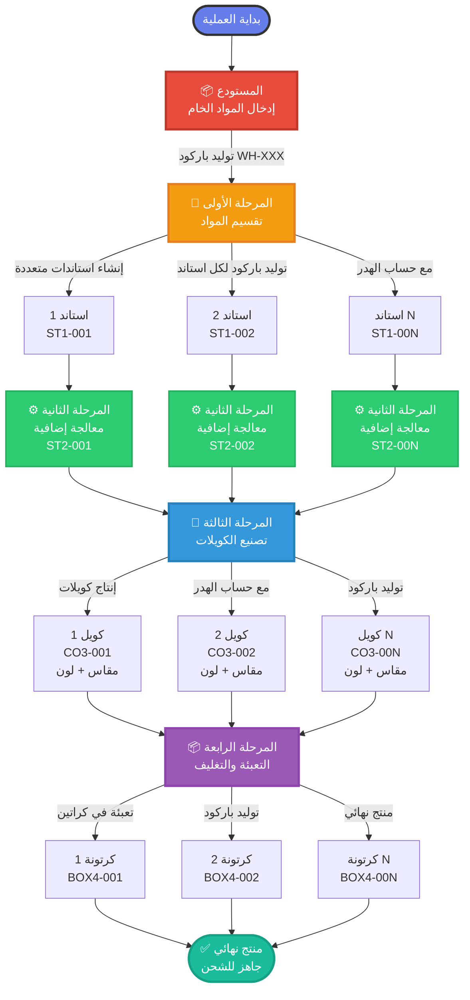
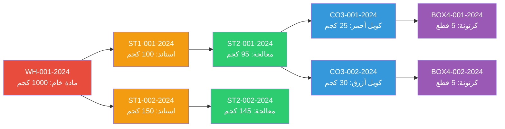
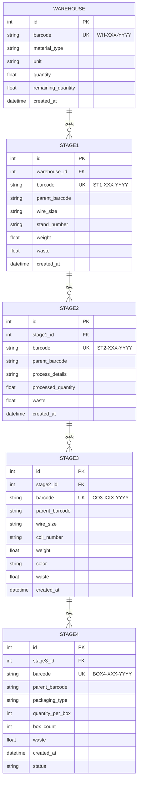
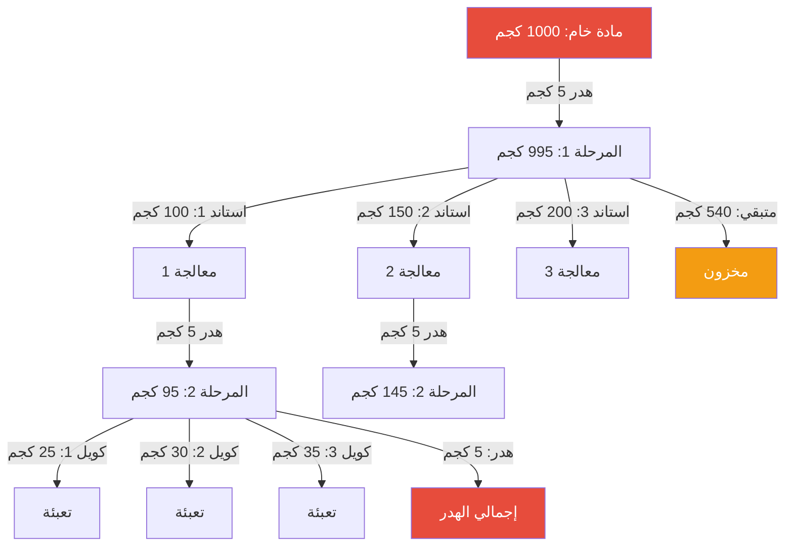
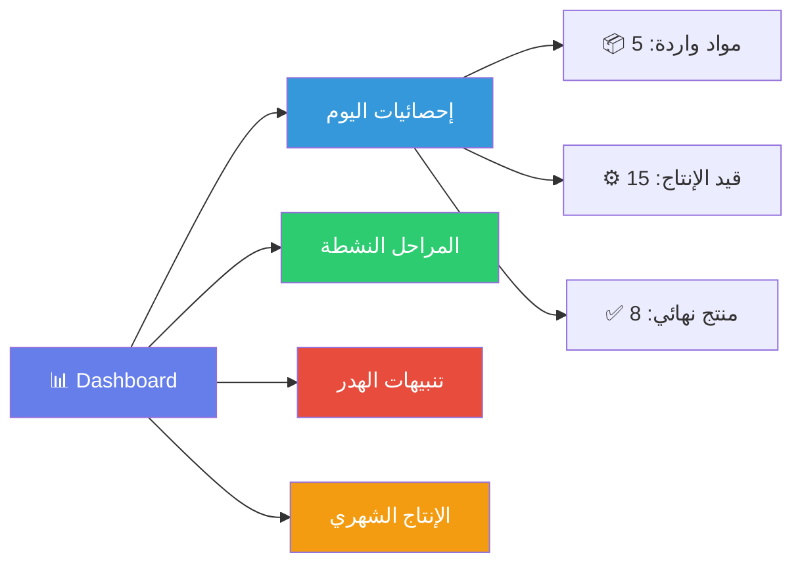
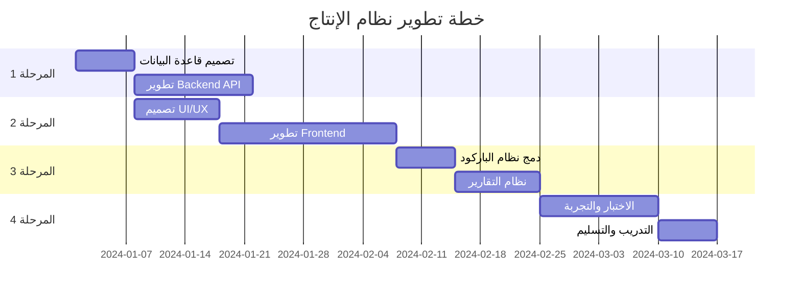
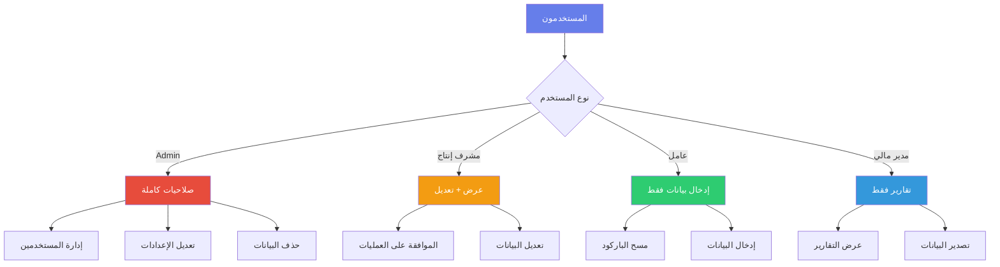

# 🏭 نظام إدارة الإنتاج - مصنع الحديد

## 📋 نظرة عامة
نظام متكامل لإدارة وتتبع عمليات الإنتاج في مصنع الحديد من المواد الخام حتى المنتج النهائي، مع نظام باركود متسلسل لتتبع كامل لسلسلة الإنتاج.

## 🎯 الهدف من النظام
- تتبع دقيق للمواد الخام والمنتجات في جميع مراحل الإنتاج
- إدارة الهدر والخسائر في كل مرحلة
- نظام باركود متسلسل للتتبع الكامل
- تقارير تفصيلية عن الإنتاج والكفاءة

---

## 📊 مخطط تدفق النظام (System Flow)



---

## 🔄 نظام الباركود المتسلسل



---

## 🏗️ معمارية قاعدة البيانات



---

## 📈 مخطط حساب الهدر



---

## 🎨 اقتراحات تحسين واجهة المستخدم

### 1. Dashboard الرئيسية


### 2. نظام الإشعارات
- 🔔 تنبيه عند انخفاض المخزون
- ⚠️ تحذير عند ارتفاع نسبة الهدر
- ✅ إشعار عند اكتمال مرحلة إنتاج
- 📊 تقرير يومي تلقائي

### 3. ميزات التتبع
- 🔍 **بحث بالباركود**: تتبع أي منتج من البداية للنهاية
- 📍 **خريطة الإنتاج**: عرض مرئي لموقع كل منتج
- 📈 **تحليل الأداء**: مقارنة الإنتاج الفعلي بالمخطط
- 🎯 **تتبع الجودة**: تسجيل ملاحظات الجودة في كل مرحلة

---

## 💡 مقترحات التحسين التقنية

### Frontend
```
📱 واجهة متجاوبة (Responsive)
├── 🖥️ Desktop: شاشات مراقبة كاملة
├── 📱 Tablet: للمشرفين في الأرضية
└── 📲 Mobile: مسح الباركود السريع
```

### Backend
```
⚙️ معمارية النظام
├── 🗄️ Database: SQL Server / PostgreSQL
├── 🔧 API: RESTful / GraphQL
├── 🔐 Authentication: JWT / OAuth2
└── 📊 Reporting: خدمة تقارير منفصلة
```

### Features المقترحة
```
✨ ميزات إضافية
├── 📸 تصوير المنتجات في كل مرحلة
├── 🔊 أوامر صوتية للأيدي المشغولة
├── 🤖 AI للكشف عن العيوب
├── 📱 تطبيق موبايل للإدارة
├── 🌐 Multi-language support
└── 📊 Power BI / Tableau integration
```

---

## 🎨 تحسينات التصميم المقترحة

### 1. نظام الألوان المحسّن
```css
/* Primary Colors */
--warehouse-color: #e74c3c;    /* أحمر للمستودع */
--stage1-color: #f39c12;       /* برتقالي للمرحلة 1 */
--stage2-color: #2ecc71;       /* أخضر للمرحلة 2 */
--stage3-color: #3498db;       /* أزرق للمرحلة 3 */
--stage4-color: #9b59b6;       /* بنفسجي للمرحلة 4 */

/* Status Colors */
--success: #27ae60;
--warning: #f1c40f;
--danger: #e74c3c;
--info: #3498db;
```

### 2. تخطيط الصفحات

#### 📊 Dashboard Layout
```
┌─────────────────────────────────────────┐
│  [Logo]    نظام الإنتاج      [User] 👤 │
├─────────────────────────────────────────┤
│                                         │
│  ┌───────┐ ┌───────┐ ┌───────┐ ┌──────┐│
│  │ مواد  │ │إنتاج │ │منتهي │ │ هدر ││
│  │  50   │ │  25   │ │  15   │ │ 2%  ││
│  └───────┘ └───────┘ └───────┘ └──────┘│
│                                         │
│  ┌─────────────────────────────────────┐│
│  │   📈 رسم بياني للإنتاج اليومي       ││
│  │                                     ││
│  └─────────────────────────────────────┘│
│                                         │
│  ┌──────────────┐  ┌──────────────────┐│
│  │ المراحل      │  │ آخر العمليات    ││
│  │ النشطة       │  │                  ││
│  └──────────────┘  └──────────────────┘│
└─────────────────────────────────────────┘
```

#### 🔧 Production Stage Layout
```
┌─────────────────────────────────────────┐
│  ← رجوع    المرحلة الأولى    مساعدة ❓ │
├─────────────────────────────────────────┤
│                                         │
│  ┌─────────────────────────────────────┐│
│  │  📷 [مسح الباركود]                 ││
│  └─────────────────────────────────────┘│
│                                         │
│  ┌─────────────────────────────────────┐│
│  │  📋 بيانات المادة                  ││
│  │  • النوع: سلك نحاسي                ││
│  │  • الوزن: 1000 كجم                 ││
│  │  • المتبقي: 750 كجم                ││
│  └─────────────────────────────────────┘│
│                                         │
│  ┌─────────────────────────────────────┐│
│  │  ➕ إضافة استاند جديد              ││
│  │                                     ││
│  │  [نموذج الإدخال]                   ││
│  └─────────────────────────────────────┘│
│                                         │
│  الاستاندات المضافة (3) ▼              │
│  ┌─────────────────────────────────────┐│
│  │ #001 | 100كجم | 2.5مم | [تعديل] [x]││
│  │ #002 | 150كجم | 3.0مم | [تعديل] [x]││
│  │ #003 | 200كجم | 2.5مم | [تعديل] [x]││
│  └─────────────────────────────────────┘│
│                                         │
│        [حفظ وإنهاء المرحلة] ✅           │
└─────────────────────────────────────────┘
```

### 3. Components مقترحة

```javascript
// Barcode Scanner Component
<BarcodeScanner
  onScan={handleScan}
  placeholder="امسح الباركود أو أدخله يدوياً"
  autoFocus={true}
  playSound={true}
/>

// Material Info Card
<MaterialCard
  barcode="WH-001-2024"
  type="سلك نحاسي"
  weight={1000}
  remaining={750}
  status="active"
/>

// Stage Progress Indicator
<StageProgress
  currentStage={2}
  totalStages={4}
  stages={['مستودع', 'تقسيم', 'معالجة', 'تصنيع', 'تعبئة']}
/>

// Waste Alert
<WasteAlert
  percentage={5.2}
  threshold={3}
  severity="warning"
/>
```

---

## 📱 هيكل المشروع المقترح

```
Production_System/
├── 📄 index.html (الصفحة الحالية)
├── 📄 README.md (هذا الملف)
│
├── 📁 assets/
│   ├── 📁 css/
│   │   ├── main.css
│   │   ├── dashboard.css
│   │   ├── stages.css
│   │   └── components.css
│   │
│   ├── 📁 js/
│   │   ├── app.js
│   │   ├── barcode.js
│   │   ├── stages.js
│   │   └── utils.js
│   │
│   ├── 📁 images/
│   │   ├── logo.png
│   │   └── icons/
│   │
│   └── 📁 fonts/
│
├── 📁 pages/
│   ├── dashboard.html
│   ├── warehouse.html
│   ├── stage1.html
│   ├── stage2.html
│   ├── stage3.html
│   ├── stage4.html
│   └── reports.html
│
├── 📁 components/
│   ├── navbar.html
│   ├── sidebar.html
│   ├── barcode-scanner.html
│   └── material-card.html
│
├── 📁 backend/
│   ├── 📁 api/
│   ├── 📁 models/
│   ├── 📁 controllers/
│   └── 📁 database/
│
└── 📁 docs/
    ├── user-guide.md
    ├── api-documentation.md
    └── database-schema.md
```

---

## 🚀 خطة التنفيذ (Roadmap)



---

## 📊 التقارير المقترحة

### 1. تقرير الإنتاج اليومي
- إجمالي المواد الواردة
- إجمالي الإنتاج لكل مرحلة
- نسبة الهدر
- المنتج النهائي
- المخزون المتبقي

### 2. تقرير الكفاءة
- معدل الإنتاج لكل عامل
- زمن إنجاز كل مرحلة
- نقاط الاختناق (Bottlenecks)
- مقارنة الأداء الشهري

### 3. تقرير الجودة
- عدد العيوب المكتشفة
- نسبة الإنتاج الجيد
- أسباب الهدر
- توصيات التحسين

---

## 🔐 الأمان والصلاحيات



---

## 🛠️ التقنيات المقترحة

### Frontend
- **Framework**: React.js / Vue.js / Angular
- **UI Library**: Material-UI / Ant Design / Bootstrap 5
- **State Management**: Redux / Vuex / Context API
- **Charts**: Chart.js / D3.js / ApexCharts
- **Barcode**: html5-qrcode / QuaggaJS

### Backend
- **Runtime**: Node.js / Python / .NET Core
- **Framework**: Express / FastAPI / ASP.NET
- **Database**: PostgreSQL / SQL Server / MySQL
- **ORM**: Sequelize / SQLAlchemy / Entity Framework
- **API**: REST / GraphQL

### DevOps
- **Version Control**: Git / GitHub
- **CI/CD**: GitHub Actions / Jenkins
- **Containerization**: Docker
- **Cloud**: AWS / Azure / Google Cloud

---

## 📞 الدعم والتواصل

- 📧 Email: support@production-system.com
- 📱 Phone: +966-XX-XXX-XXXX
- 🌐 Website: www.production-system.com
- 📝 Documentation: docs.production-system.com

---

## 📝 الترخيص

هذا المشروع محمي بحقوق الملكية © 2024

---

## 🎯 الخلاصة

نظام إدارة الإنتاج هذا مصمم ليكون:
- ✅ **شامل**: يغطي جميع مراحل الإنتاج
- ✅ **دقيق**: تتبع كامل عبر الباركود
- ✅ **فعال**: واجهة سهلة الاستخدام
- ✅ **قابل للتطوير**: معمارية مرنة
- ✅ **آمن**: نظام صلاحيات متقدم

---

<div align="center">
  
### 🚀 ابدأ الآن وحسّن إنتاجك!

**Made with ❤️ for Manufacturing Excellence**

</div>
